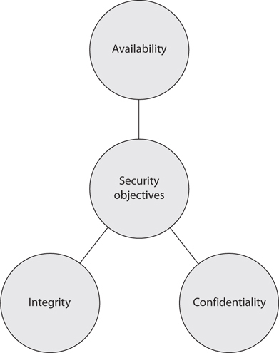

# 2. Introduction to Cybersecurity 

This module covers the definition of Cybersecurity and explores its importance. 
It also explores the role every individual has to play ito ensure security. 

## Learning Outcomes

By the end of this module, participants should be able to:
*	Define cybersecurity
* Explain the importance of cybersecurity
* Identify their role in ensuring cybersecurity
* Identify who is behind cybersecurity attacks

## What is Cybersecurity 
Cyber security is the practice of protecting systems, devices, networks, programs and information from digital attacks. Its main function is to protect the information stored in these systems from modification and unauthorized access. 
Cyber security is characterized by the CIA Triad:
* __Confidentiality__: Protection of data from unauthorized access. For instance, 
* __Integrity__: Prevent unauthorized modification of information or files
* __Availability__: Ensure timely access to resources

## Elements of Cybersecurity 
1. __Network Security__ - is the practice of securing a computer network from intruders, whether targeted attackers or opportunistic malware.
1. __Application Security__ - focuses on keeping software and devices free of threats. A compromised application could provide access to the data its designed to protect. Successful security begins in the design stage, well before a program or device is deployed.
1. __Information Security__ - protects the integrity and privacy of data, both in storage and in transit.
1. __Operational Security__ - includes the processes and decisions for handling and protecting data assets. The permissions users have when accessing a network and the procedures that determine how and where data may be stored or shared all fall under this umbrella.
1. __Disaster Recovery and Business Continuity__ - define how an organization responds to a cyber-security incident or any other event that causes the loss of operations or data. Disaster recovery policies dictate how the organization restores its operations and information to return to the same operating capacity as before the event. Business continuity is the plan the organization falls back on while trying to operate without certain resources.
1. __End-user Education__ - We started this training program to address the most unpredictable cyber-security factor: __people__. Anyone can accidentally introduce a virus to an otherwise secure system by failing to follow good security practices. Teaching users to delete suspicious email attachments, not plug in unidentified USB drives, and various other important lessons is vital for the security of any organization or individual. 

## What is my role in Cybersecurity? 
It’s important to recognize the different types of risks that
exist in the online world. When online,it's imperative to always keep this in mind: __Stop.
Think. Connect.__ Stop for a moment. Think deeply about how you will
take care of your information and personal data before acting.
Connect responsibly. 

We’re all human and we make mistakes. However there are a plethora of malicious people who are constantly trying to take advantage of every single silly mistake which can cost individuals/businesses tremendous financial loss. Advanced technology and security practices, no matter how sophisticated, will always be constrained by this human factor.

> "The weakest link in the security chain is the human element." - Kevin Mitnick 

## Benefits of Cybersecurity
Some key benefits of cybersecurity includes:

1. Business/Individual protection against Cyber threats such as malware, ransomware, phishing and social engineering.
1. Protection for sensitive data and networks.
1. Prevention of unauthorized users. 
1. Protection for end-users of computers, systems, applications and the internet.
1. Improved confidence in digital products for both developers and their customers.

## Impacts of Cyber attacks
Cyber attacks have devastating efects on both companies and individuals. Cyber attacks may lead to: 
*	Financial losses. 
*	Damage of brand image and reputation. 
*	Loss of confidential data. 
*	Identity theft. 
*	Inconvenience of normal business operations. 

Therefore, it's the responsibility of every single individual to protect organizations and themselves from these consequences of cyber attacks. Cybersecurity is a collective effort. 

## Who is behind Cyber attacks ?
Who is behind cyber attacks? 
* Online criminals 
* Foreign governments commonly known as Nation State Actors. 
* Hackers
*	Terrorists 
*	Malicious insiders  
* Competitors  
*	Political activists commonly known as Hacktivists

Next >  [3. Cybersecurity Threats](https://the-mind.github.io/OnlineSecurity/training/cybersecuritythreats)

