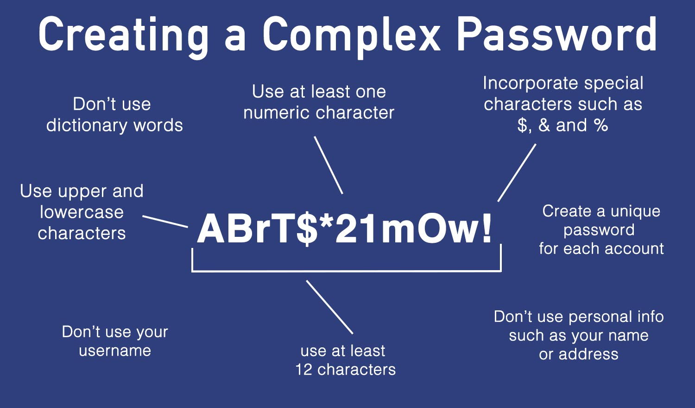
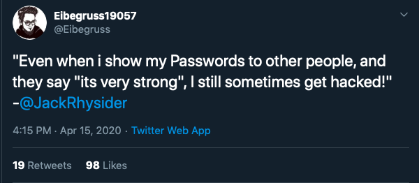
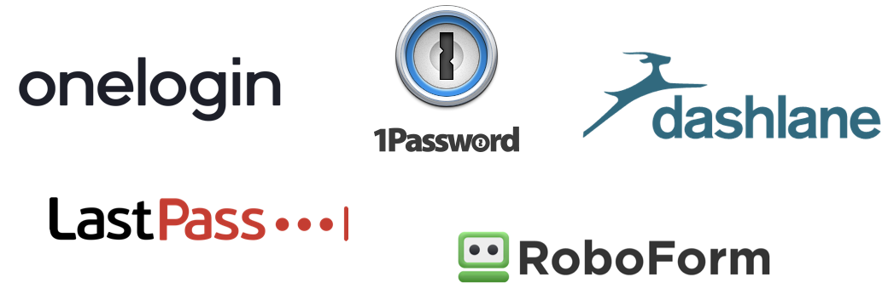

## Table of Contents

1. [Introduction](https://the-mind.github.io/OnlineSecurity/)
1. [Introduction to Cybersecurity](https://the-mind.github.io/OnlineSecurity/training/introduction)
1. [Cybersecurity Threats](https://the-mind.github.io/OnlineSecurity/training/cybersecuritythreats)
    * [3.1 Social Engineering](https://the-mind.github.io/OnlineSecurity/training/socialengineering)
    * [3.2 Malware](https://the-mind.github.io/OnlineSecurity/training/malware)
    * [3.3 Malicious Websites](https://the-mind.github.io/OnlineSecurity/training/maliciouswebsites)
1. [Personal Security](https://the-mind.github.io/OnlineSecurity/training/personalsecurity)
1. [Password Security](https://the-mind.github.io/OnlineSecurity/training/passwordsecurity)
1. [Secure Online Communications](https://the-mind.github.io/OnlineSecurity/training/securecommunications)
    * [6.1 Secure your Instant Messaging Apps](https://the-mind.github.io/OnlineSecurity/training/secureim) 
    
# 5. Password Security 

Passwords are used to log into most systems and applications. With increasing number of online accounts, people have a tendency to use simple and easy to remember passwords that are shared among these sites. For instance, you will find someone using the same password for both gmail and facebook. 
Cyber attackers will try common password phrases in an attempt to crack your password. If correctly cracked, the attacker has access to all the sites that this password is used.

## How are passwords discovered?

1. __Interception__ - Passwords can be intercepted as they travel over a network.
1. __Brute force__ - Automated guessiong of billions of passwords until correct one is found. 
1. __Dictionary attacks__ - Avoid consecutive keyboard combinations— such as __qwerty__ or __asdfg__. Don’t use dictionary words, slang terms, common misspellings, or words spelled backward. These cracks rely on software that automatically plugs common words into password fields. 
1. __Key logging__ - Installing a keylogger to intercept passwords when they are entered.  
1. __Shoulder surfing__ - Observing someone typing in their password. 
1. __Manual guessing__ - Information posted online such as dates of birth or pet names can be used to guess passwords.
1. __Cracking security questions__ - When you click the __“forgot password”__ link within a webmail service or other site, you’re asked to answer a question or series of questions. The answers can often be found on your social media profile.
1. __Phishing and coercion__ - Using social engineering techniques to trick people into revealing passwords.  
1. __Data breaches__ - Using the passwords leaked from data breaches to attack other systems. 
1. __Stealing passwords__ - Insecurely stored passwords can be stolen, such as ones written on sticky notes and kept near(or on) devices
1. __Stolen hashes__ - Stolen hash files can be broken to recover the original passwords. 
1. __Password spraying__ - Trying a commonly-used passwords to access a large number of accounts. 

Passwords can only do so much. Even when implemented correctly, passwords are limited in helping prevent unauthorized access.
If an attacker discovers or guesses the password, they are unable to impersonate a user.

## What makes a password strong ?

Strong passwords are hard to guess. Characteristics of a strong password include:
1. At least 8 characters—the more characters, the better
1. A mixture of both uppercase and lowercase letters
1. A mixture of letters and numbers
1. Inclusion of at least one special character, e.g., ! @ # ? ]

> Avoid the use of predictable passwords such as your name, date of birth, pet’s names etc. Through social media, attackers can collect this kind of information and thus make it easier for them to compromise your password and access your accounts. 

## How to make your passwords secure
1. Make sure you use different passwords for each of your accounts.
1. Be sure no one watches when you enter your password. Always watch out for shoulder surfers. 
1. Always log off if you leave your device and anyone is around—it only takes a moment for someone to steal or change the password.
1. Check your password strength. If the site you are signing up for offers a password strength analyzer, pay attention to it and heed its advice.
1. Avoid entering passwords on computers you don’t control (like computers at an Internet café or library)—they may have malware that steals your passwords.
1. Avoid entering passwords when using open/unsecured Wi-Fi connections (like at the airport or coffee shop)—hackers can intercept your passwords and data over this unsecured connection.
1. Use comprehensive security software and keep it up to date to avoid keyloggers (keystroke loggers) and other malware.
1. 3.	Separate personal from work. Use separate passwords for personal and work accounts. In case attackers compromise your personal accounts, your work accounts will be safe. 
1. Depending on the sensitivity of the information being protected, you should change your passwords periodically, and avoid reusing a password for at least six months.
1. Don’t tell anyone your password. Your trusted friend now might not be your friend in the future. Keep your passwords safe by keeping them to yourself.
1. Do use at least eight characters of lowercase and uppercase letters, numbers, and symbols in your password. Remember, the more the merrier.
1. Don't bunch up your special characters. Put your digits, symbols, and capital letters spread throughout the middle of your password, not just at the beginning or end. 

> It's important to always use __Multi Factor Authentication(MFA)__ on all of your accounts. MFA is a method to double check whether it is you trying to access the account. Other than the password or passcode, another factor such as a security token or a smartphone can be used to validate that you are who you say you are online. An example is when you log into gmail and a verification code is sent to your mobile phone. 

## Password managers 

You can use a password manager like to store your passwords for you. The major browsers all have password storage systems, while cloud options like [LastPass](https://www.lastpass.com/) work from any computer with internet access.

There are pros and cons to this method. 

### Pros
1. Humans can be unreliable as they can come up with bad/weak passwords, forget their password, or are genuinely disinterested in their own security. With a Password Manager there is no need to worry about remembering all your different passwords.
1. Using the same credentials for each account is dangerous as it creates one point of failure.
1. Good password managers encrypt all your personal data in case someone hacks the PM software directly; the hacker might get your passwords but they won’t know who the passwords belong to.
1. Password Managers can keep you up to date with the latest breaches and advise you if any accounts may have been affected/hacked. 
1. Can use offline password manager (not stored on the web/not a web browser plugin like [KeePass](https://keepass.info/){:target="_blank"}

### Cons
1. Single point of failure - if someone gets hold of your master password, they have all your passwords.
1. Password manager programs are a target for hackers.
1. It's not easy to login using multiple devices.
1. If the main password is used/typed/saved on a computer with malware, your main password can compromise all your other passwords controlled by the Password Manager - all your passwords are only as secure as your master password.
1. Not all PM's are adequately encrypted which can render the whole process of setting one up useless.

> Perhaps the simplest advice we can give, is to have __Two Factor Authentication(2FA)__ when possible. Two factor authentication is a two step verification that along with your password and username, requires another level of authentication. Hence, if someone gets hold of your password, they won't be able to proceed without entering the next level of authentication.

## Activity 

* Take participants through identification of weak and strong passwords.
* [Participants to set up their own password vault using Docker ](https://medium.com/swlh/set-up-your-own-personal-password-vault-313d76374046){:target="_blank"}

## Resources
* [You need a password manager](https://medium.com/swlh/set-up-your-own-personal-password-vault-313d76374046){:target="_blank"} 
* [7 Password Experts on How to Lock Down Your Online Security](https://www.wired.com/2016/05/password-tips-experts/){:target="_blank"}

Next > [6. Secure Online Communications](https://the-mind.github.io/OnlineSecurity/training/securecommunications)

 

 

