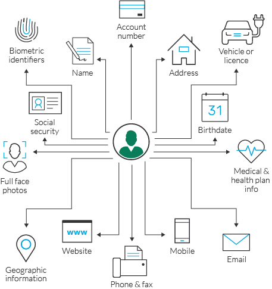

# Personal Security

Kenyans were ranked the most care-free users of the Internet globally. Only four in every 10 internet users in Kenya are concerned about their privacy online, according to a report by the United Nations Conference on Trade and Development (UNCTAD) released on September 2019. Read the [official report by UNCTAD here](https://unctad.org/en/PublicationsLibrary/der2019_en.pdf){:target="_blank"} and the [press release from NMG here.](https://www.nation.co.ke/news/Kenyans-the-most-carefree-users-of-internet/1056-5261054-1b6rqjz/index.html){:target="_blank"}

This is the lowest level in the world according to the report and ranks poorly against the global average of eight in every 10 users. This clearly indicates that there’s a lot of work that needs to be done to ensure Kenyans protect their data and Personally Identifiable Information to the best of their abilities. 

## What is PII? Personally Identifiable Information

This refers to any information that can lead to locating and contacting an individual and identifying that individual uniquely. These include:

*	Full Name and Parents’ names
* National ID & Passport Number
* Bank account numbers
* Phone number
* Home address 
* Driving License
* Vehicle registration number
* Biometrics
*	KRA Pin 
* NHIF(National Hospital Insurance Fund) Number
* NSSF(National Social Secuity Fund) Number

## What you can do 
* Don’t respond to unsolicited requests for personal information by phone, mail or online.
* Adopt a __clean desk policy__ - Not leaving passwords on pieces of paper on one’s desk and other valuable information.
* Not leaving computers on and not password protected. __Trust no one__, always lock your devices when stepping out. 
* Review your receipts. Promptly compare receipts with account statements and look for any unauthorized transactions
*	Store personal or sensitive information in a safe place at home and at work. Lock up important documents. 
* Install firewalls and virus-detection software on your home computer.
* Watch out for shoulder surfers specifically when entering sensitive information such as when entering passwords at your computer or pins at ATMs. 
* Shred receipts, credit offers, account statements, and expired cards, to prevent
__” dumpster drivers”__ from getting your personal information

## 8 tips of staying cyber-safe while telecommuting
These tips will help you stay safe online while telecommuting normally or during pandemics such as the __Covid-19 pandemic__.

### 1. Secure your home network 
* Create a strong router password. (We'll discuss strong passwords at a later point.)
* Activate WPA2 (Wi-Fi Protected Access) encryption technology. 

### 2. Hide your work/personal laptop. 
* Always ensure the network discovery function is turned off. 

### 3. Stay Private
* Cover your webcam, if not in use. 
* Deactivate your microphone after teleconferences. 
* __DON'T__ discuss sensitive information over unsecured networks. 

### 4. Click Prudently
* Avoid downloading apps, unknown software, music or videos from untrusted websites. 
* Use official sources for information i.e on Covid-19

### 5. Beware of Phishing 
* Even if an e-mail or text message appears to be from a familiar source, always double-check details: spelling, grammar etc. 
* If in doubt, alert your IT Security Manager or someone trustworthy in a position to help. 
* Don't forward the email to colleagues. 
* Don't open attachments or click on fishy links. 

### 6. Be careful with social media
* Social Networks can be vulnerable to cyber threats; avoid using social media on business devices. 
* Ensure antivirus solutions are installed and up t date. 

### 7. Use secured platforms 
* Switch to secure authentication services and Virtual Private Networks (VPNS) to send sensitive information.
* Use "hacker-proof" remote collaboration tools like Wire & Microsoft Teams. 

### 8. Go offline 
* Disable your Wi-Fi at night to prevent cyberattacks. 
* Swicth off borh your VPN and your computer at the end of the day to enable system updates. 

 Next > Password Security 

