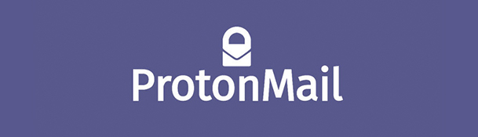

## Table of Contents

1. [Introduction](https://the-mind.github.io/OnlineSecurity/)
1. [Introduction to Cybersecurity](https://the-mind.github.io/OnlineSecurity/training/introduction)
1. [Cybersecurity Threats](https://the-mind.github.io/OnlineSecurity/training/cybersecuritythreats)
    * [3.1 Social Engineering](https://the-mind.github.io/OnlineSecurity/training/socialengineering)
    * [3.2 Malware](https://the-mind.github.io/OnlineSecurity/training/malware)
    * [3.3 Malicious Websites](https://the-mind.github.io/OnlineSecurity/training/maliciouswebsites)
1. [Personal Security](https://the-mind.github.io/OnlineSecurity/training/personalsecurity)
1. [Password Security](https://the-mind.github.io/OnlineSecurity/training/passwordsecurity)
1. [Secure Online Communications](https://the-mind.github.io/OnlineSecurity/training/securecommunications)
    * [6.1 Secure your Instant Messaging Apps](https://the-mind.github.io/OnlineSecurity/training/secureim) 
    
# 6. Secure Online Communications

Secure Online Communications is one of the most important aspects of Online Security. Here’s what a secure form of communication looks like:
* __Private-__ Your information shouldn’t be viewable by any third parties.
* __Hard to penetrate-__ It should be extremely difficult for any cybercriminals to break into your system by guessing your password, exploiting bad code, or leveraging API loopholes.
* __Reliable-__ Your communication should be consistently reliable, with no interruptions or vulnerabilities to exploit.

To support you in staying safe online, we will share tools and products that you can leverage to enhance your digital security. 

__NOTE:__ As you explore the tools, please keep these points in your mind.

* Despite the sophistication of the tools mentioned below, you should not rely solely on digital products for your online safety. Your security starts with __YOU.__
* It is impossible to be 100% secure online. 
* You should always make sure you are following all the laws and regulations like [GDPR](https://gdpr-info.eu/){:target="_blank"} and [Kenya's Computer Misuse and cybercrimes Act, 2018](http://kenyalaw.org/kl/fileadmin/pdfdownloads/Acts/ComputerMisuseandCybercrimesActNo5of2018.pdf){:target="_blank"} (even if they are burdensome). 
* Carefully review and understand the privacy policies of the tools before using them.
* Adopting new technology is like a behavior change – it takes time and effort, so be patient if you decide to adopt and use one of the tools. 

## Communication Tool recommendations
### For a messaging/chat service:
__Common risks/recommendations for messaging/chat services:__

* Most messaging services lack encryption – pick an app that offers end-to-end encryption.
* Avoid using the messaging services through open networks, such as Public Wi-Fi in cafes or airports.

__Possible products to consider:__

1. [Signal](https://signal.org/){:target="_blank"} - Signal is a pure-play text-messaging solution — and it’s often described as the most secure app of its kind. Signal’s messaging app uses end-to-end encryption. Additionally, Signal is also built on an open-source code base, which means its inner-workings are regularly peer reviewed and audited by coders — and that means its security protocols are generally up to date and state of the art. If you adopt Signal, make sure to always update the app when a new version is released, and if you are a heavy user, follow their developer change logs for updates.

1. [Telegram](https://telegram.org/){:target="_blank"} - It’s a free app that offers end-to-end encryption and is thus secure.  What’s also great is that it has a self-destruct mode where you can set a timer to an individual message, and it automatically disappears. 

> If you had to choose between Signal or Telegram, always prioritize Signal.

### For Email:
__Common risks/recommendations for email systems:__

* Common threats for email security includes: malicious attachments, email interception, weak passwords, spamming, phishing/spear phishing. 
* Some ways to manage these common problems include:
 * no opening suspicious emails/links, 
  *take note of where you use your email address (i.e. sign ups on websites),
  *use more secure/stronger passwords, 
  *Do __NOT__ reply to SPAM. 

Possible products to consider:

1. [Proton Mail](https://protonmail.com/){:target="_blank"} - Even though its user interface is simple, streamlined and easy to use right out of the box, ProtonMail’s backend platform features a complex and seemingly impenetrable series of security measures. Because the decryption of messages sent and received through the ProtonMail service happen in the browser, ProtonMail’s own servers store only the encrypted version of its customers’ emails — and there is no key for decoding these messages on the servers, either. Also worth noting: ProtonMail allows customers to exchange secure email messages with any email address — not just other ProtonMail users. 

2. [Tutanota](https://tutanota.com/){:target="_blank"} - is an end-to-end encrypted email software and freemium hosted secure email service. Its business model excludes earning money through advertisement relying solely on donations and Premium subscriptions. The motto of the service __"einfach.sicher.mailen"__ means __"easy.secure.mailing"__. Tutanota is undeniably one of the best and most secure mail platforms currently. 

### For storage space:
__Common risks/recommendations for storage space solutions:__

* Common threats to storage services are user error and insider activity. This can be costly. 
* Possible threats include compromised credentials (usernames, passwords), lack of encryption, and the more users a certain storage stage has = the higher the possibility to attract more hackers. 
* To counter these risks, consider:
  * creating stronger passwords, 
  * consistently auditing all connected devices and watch out for any suspicious ones, 
  * spread sensitive data between different storage spaces, 
  * always review what is being shared.
  
__Possible products to consider:__

1. If you already use a certain cloud-based storage space (such as Dropbox, Microsoft OneDrive, Google Drive, etc.), which are not entirely secure, you can add an extra layer of protection. Such as:
* Use a two-step authentication process
* Add a third party encryption (such as [Boxcryptor](https://www.boxcryptor.com/en/){:target="_blank"}, which encrypts data on devices before they are synchronized to the cloud)
2. [Spideroak](https://spideroak.com/){:target="_blank"} is an increased security cloud-based storage service. It offers up to 2GB of free trial for 60 days (after that, it’s $7/month for 30 GB or $12/month for 1 TB), has zero knowledge encryption (means your data is 100% private and only readable by you), does not store users’ passwords nor encryption keys; storage redundancy savings, and syncs across all devices. 

### For videoconferencing:

1. [Wire](https://app.wire.com/){:target="_blank"} - Business/Personal chats, one-click conference calls and shared documents – all protected with end-to-end encryption. It's not only secure but open source too. 

>  All of these tools have been around for at least 5 years, which is a good sign. It means that the products are well vetted and well-funded. Often you read and hear about new apps or solutions created by startups, but they do not stick around for various reasons. As you come across new technologies, be mindful that one of the key factors to consider is whether the app itself will be around for longer than a year. Play around with the suggested tools above, and see what works best for your specific use cases.  

## Good practices for Secure Online Communications
Merely choosing a secure channel may not be enough to protect you. You’ll have to follow these good practices if you want to ensure your communication is as secure as possible:
1. __Be choosy.__ There are hundreds, if not thousands, of apps out there advertising their “security,” but not all of them will offer you the same level of protection. Before you buy, download, or start using these apps, do your homework. Learn why they claim to be secure, read up on user reviews, and compare them to their competitors to make sure you’re using the best option.
1. __Use a VPN.__ A virtual private network (VPN) will give you a secure tunnel through which you can send and receive information online, as if you were operating using a private server. 
1. __Avoid reliance on telecommunication.__ Phone calls and text messages may seem like the straightforward way to communicate, but any form of communication that relies on a cell tower is inherently unsecure. For this reason, it’s best to communicate when you’re connected to a secured Wi-Fi network, rather than using your 4G network—and that also means avoiding publicly accessible Wi-Fi networks, like those in coffee shops,school libraries or even coffee shops.
1. __Choose and rotate strong passwords.__ It’s a simple best practice, but one that you can’t afford to neglect; choose a strong password for your login, and create new passwords to replace it on a regular basis. Refer to our [Password Security Module](https://the-mind.github.io/OnlineSecurity/training/passwordsecurity){:target="_blank"}
1. __Think carefully about what information you send.__ As an added layer of security, don’t send information unless you have to share it, or unless you’re perfectly comfortable with that information leaking. Even with the best security practices and apps in place, there’s no reason to make yourself vulnerable unless you have to.

## Activity
* Participants should share products they use to enhance the security of their communications online. 
* Participants should take their time to test some of these products and decide on which ones they will adopt. 
* Watch the video below



Next > [6.1 Securing Instant Messaging Apps](https://the-mind.github.io/OnlineSecurity/training/secureim)

