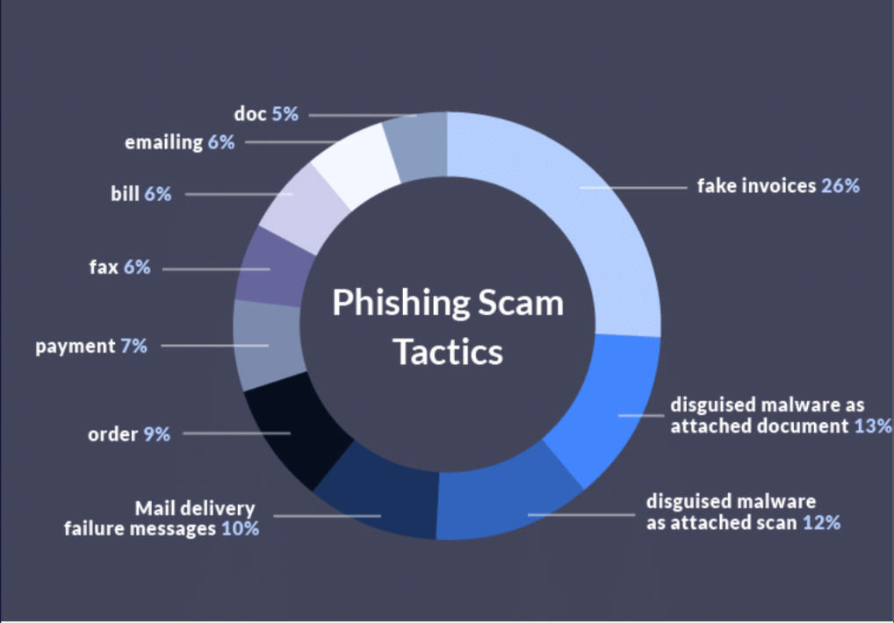
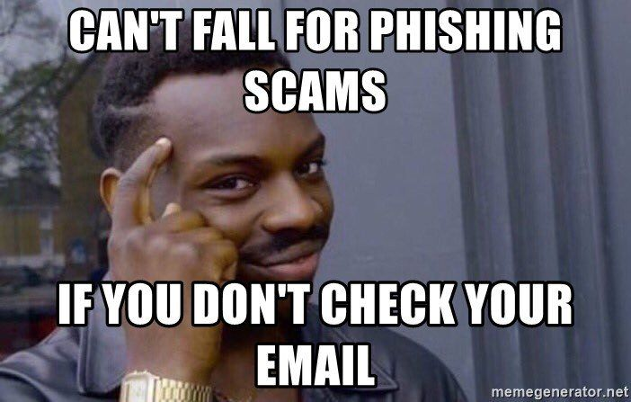
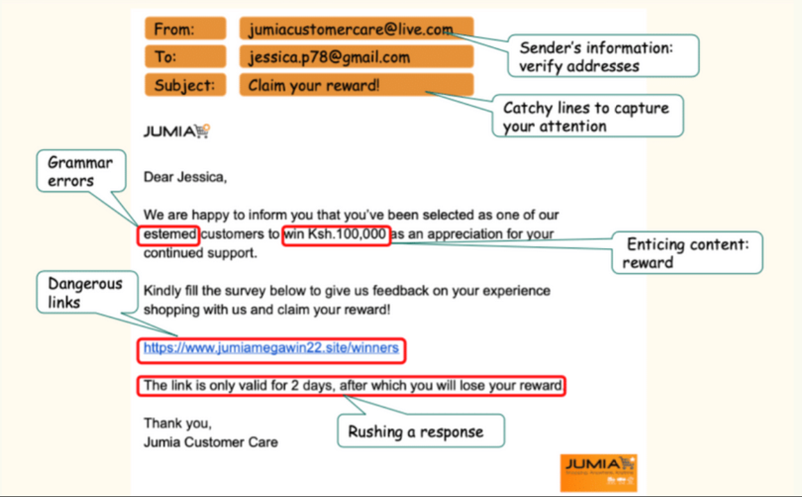

## Table of Contents

1. [Introduction](https://digital-safety.net)
1. [Introduction to Cybersecurity](https://digital-safety.net/training/introduction)
1. [Cybersecurity Threats](https://digital-safety.net/training/cybersecuritythreats)
    * [3.1 Social Engineering](https://digital-safety.net/training/socialengineering)
    * [3.2 Malware](https://digital-safety.net/training/malware)
    * [3.3 Malicious Websites](https://digital-safety.net/training/maliciouswebsites)
1. [Personal Security](https://digital-safety.net/training/personalsecurity)
1. [Password Security](https://digital-safety.net/training/passwordsecurity)
1. [Secure Online Communications](https://digital-safety.net/training/securecommunications)
    * [6.1 Secure your Instant Messaging Apps](https://digital-safety.net/training/secureim)
    
# 3.1 Social Engineering
Social engineering is a technique that uses psychological manipulation to trick users into making security mistakes or giving away sensitive information. This is one of the greatest threats to cybersecurity today because it takes advantage of people’s trusting nature hence it is less predictable and harder to detect and respond to. 

Ideally, an attacker gathers information about a user and uses it to establish trust. Once trust is established, the attacker gets the targeted information without raising suspicion. 

> Social Engineering undoubtedly presents the greatest threat to confidentiality today. 

## Types of Social Engineering Techniques
### 1. Phishing 
Phishing is one of the most popular social engineering techniques. It involves scams sent via emails, text messages or calls. These scams create a sense of urgency or inspire fear in the target causing them to click on malicious links, divulge sensitive information or download malicious attachments.  

Phishing done via text messages is known as __smishing__ while phishing done via phone calls is known as __vishing__. Vishing can be combined with other forms of social engineering
Attackers also take advantage of current events and certain times of the year. These include: 
* Natural disasters (e.g. Hurricane Katrina, Indonesian tsunami)
* Epidemics and health scares (e.g. Covid-19, H1N1)
*	Economic concerns (e.g. KRA scams)
*	Major political elections
*	Holidays 

#### Examples of Phishing Scams
* An employee can receive an email that looks to be from Facebook, alerting them to change their passwords. The email also contains a link to almost a replica of Facebook’s login page. Upon clicking and inputting their username and password, these credentials are sent to the attacker. 
* An instance of smishing is when people send crafted MPESA messages. The attacker then proceeds to call and create a sense of urgency, deceiving the target to send money to the attacker.

### 2. Spear Phishing
Spear phishing is a __targeted form__ of phishing. It targets specific individuals, or organization. These scams are usually tailored to fit the target’s characteristics such as job position and contacts. This makes it less conspicuous. Therefore, spear phishing has a higher success rate but takes longer to plan and execute. 

### 3. Baiting
Baiting uses a __false promise__ to pique a target’s __curiosity or greed__. This causes the victim to visit/click a malicious website or even plug in a removable media. For instance, enticing ads such as __"Win an iPhone"__ or even cars.

Attackers can also leave infected USB flash drive  with tags such as ‘payroll’, and out of curiosity, employees fall victim and end up executing malware on their machines(once they plug in the USB).

### 4. Pretexting
In this technique, an attacker uses __crafted lies__ to steal information. The attacker pretends to be from a trusted authority such as banks or police, so as to build trust.

For instance, in the Kenyan context, an attacker may impersonate a Safaricom customer care representative and ask the victim to reveal private information such as ID number, MPESA PIN etc.

### 5. Quid pro quo 
Quid pro quo attacks promise a benefit in exchange for information. 

## Prevention of Social Engineering

1. __Multi Factor Authentication(MFA)__ - Most attackers are after user credentials, therefore, multi factor authentication protects your accounts in the event of compromise.
2. __Install Anti Malware Software__ - Anti-malware software will detect and protect your machine from malicious attachments that contain malware.
3. __Email Security__ - Email is currently the most common way cyber criminals launch and distribute threats. The level of sophistication of email attacks has increased over the past few years. It’s very vital to protect against phony emails. 
Often email attachments are means of distributing malicious code. 

Links in the emails may redirect to sites that seem legitimate but are used for phishing. Often by clicking these links, your system becomes infected and you too, will be propagating those links.

Malware will __“read”__ an infected user’s email list and replicate itself to other users.

> Just because an email indicates it originates with trusted source doesn’t mean that is actually true.

## What to do 
* __DO__ not click links in messages (especially from senders you don’t know).
* __ALWAYS__ check the email address - does it really match the text in the email? If in doubt, use known links and contacts outside those provided in email. 
* __DO__ not download files from unsolicited sources.
* __WATCH__ for poor grammar, misspellings, urgent message, pleas for money. 
* If you're unsure whether an email request is legitimate, try to verify it by contacting the company directly.

## Activity 
Participants should watch the following videos:



 



 



Participants will also be taken through practical identification of phishing emails during the online session. Image used for the session. 

Next > [3.2 Malware](https://digital-safety.net/training/malware)

